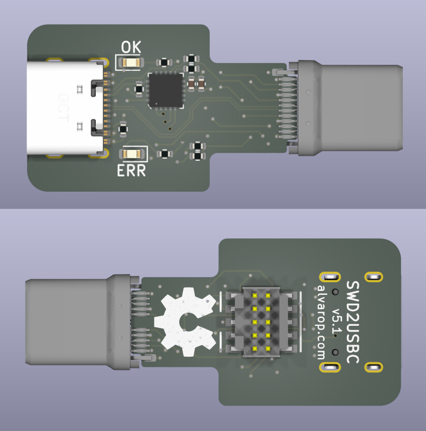
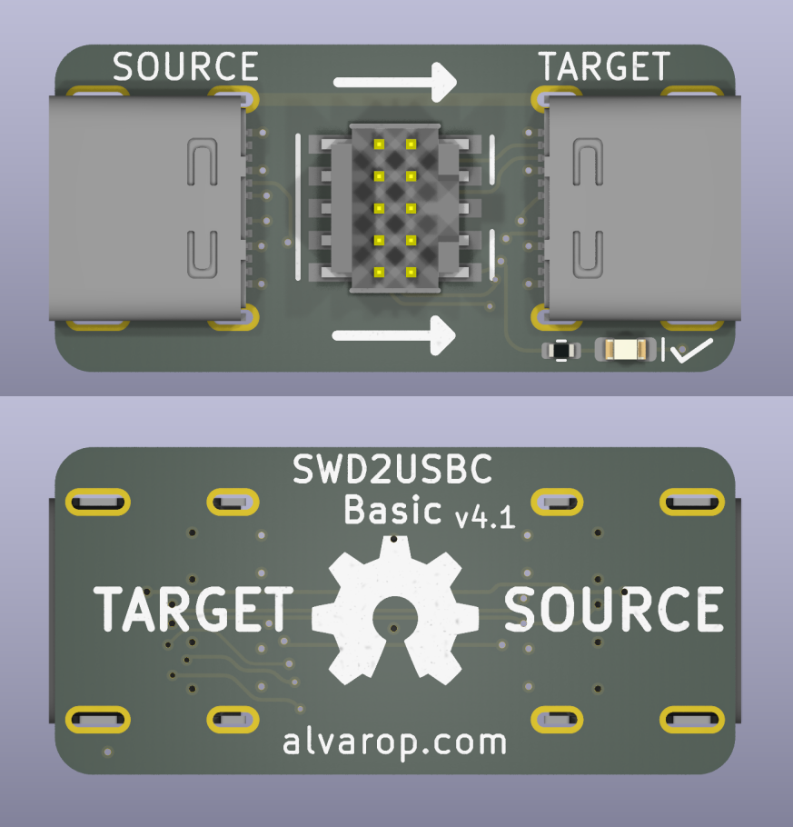
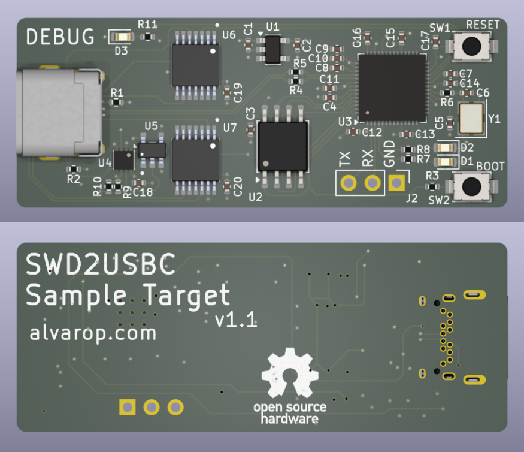
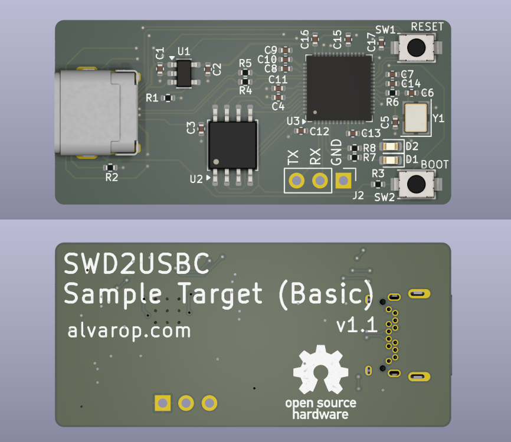

# SWD2USBC Project

Have you ever wanted to debug your device over USB-C? Sometimes there's not enough room for a JTAG/SWD connector, or even [Tag-Connect](https://www.tag-connect.com/) pads!

TODO - link to detailed blog post

## SWD2USBC
 

Full featured adapter with Debug Accessory Mode support. Includes an ATTiny microcontroller to set the correct pull-up resistors on CC1/CC2 to provide accurate charge current to the target. Has a USB-C plug so no extra USB-C cable required

### SWD2USBC Firmware
The ATTiny firmware doesn't do much. It reads the voltage on the CC1/CC2 line that is pulled up and determines the available charge current. It then pulls up CC1 **and** CC2 to provide the charge current to the device under Debug Accessory Mode.

## SWD2USBC Basic
 
Simple adapter with no Debug Accessory Mode. Assumes target SWD lines wired up directly to TX1/2 as listed above. Requires USB3/Thunderbolt C to C cable to connect to target.

## Sample Target 
 

Example target device. Fully featured with CC1/2 comparators to connect/disconnect SWD lines if Debug Accessory Mode is active. Target is an RP2040 instead of STM32 since it's easier to source.

### Sample Target Firmware
The sample target firmware does basic USB charge detection using the CC lines. When the Debug Accessory Mode is enabled, both CC1/CC2 are used, otherwise, the single CC line is used. There's an LED (D3) which lights up when Debug Accessory Mode is enabled.

The charge current is printed out over UART, but it is also displayed using the two LEDs. The blink patterns are:
* **500mA** - LED1 (D1) blinks 
* **1500mA** - LED2 (D2) blinks 
* **3000mA** - Both LED1 (D1) and LED2 (D2) blink at the same time
* **Other/Error** - Both LED1 (D1) and LED2 (D2) alternating blink

## Sample Target Basic
 

Basic example target. Similar to the sample target above, but does not include any comparators/switches. SWD lines are directly connected to the USB-C connector.

## SWD2USBC Programmer
Simple adapter PCB to connect the AVRISP V2 connector to USB-C to program the ATTiny in the SWD2USBC device.

 

